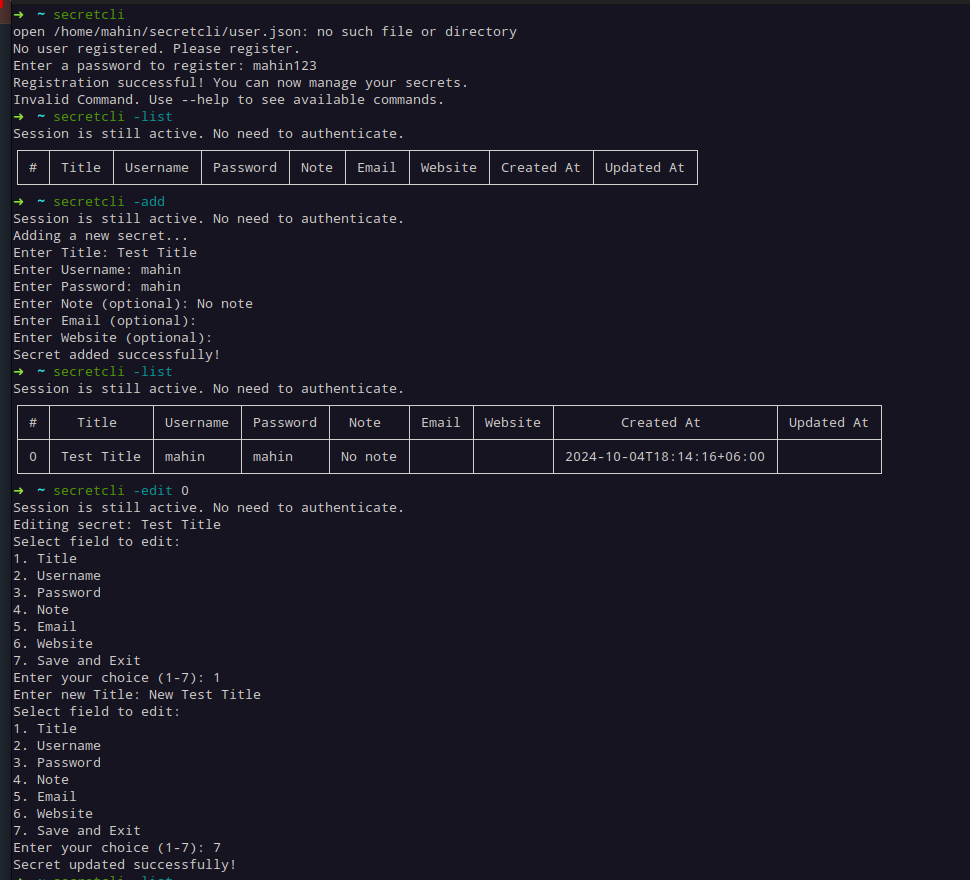
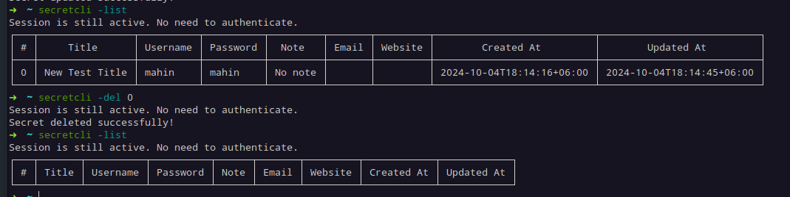

# Secret CLI

**Secret CLI** is a command-line tool designed for securely managing secrets and sensitive information. It provides a simple and efficient interface for creating, storing, and retrieving secrets in a secure manner.

## Features

- **Secure Storage**: Safely store your secrets using encryption.
- **User Authentication**: Register and authenticate users to access their secrets.
- **Command-Line Interface**: Simple and intuitive command-line interface for managing secrets.
- **Cross-Platform Compatibility**: Works on any system with a compatible terminal.
- **Easy to Use**: Minimal setup required for quick access to your secrets.

## Installation

To install Secret CLI, follow these steps:

1. Download the Binary from [here](https://github.com/mahinops/secretcli/releases/tag/v1.0.0) based on your machine architecture.

    If you are not sure. Try these commands_
    **Ubuntu:**
    ```bash
    uname -m
    ```
    - `x86_64` indicates an AMD/Intel architecture.
    - `armv7l` or aarch64 indicates an ARM architecture.


    **Mac:**
    ```bash
    uname -a
    ```

    **Windows:**
    ```bash
    echo %PROCESSOR_ARCHITECTURE%
    ```


2. Move the Binary to a Directory in PATH
    ```bash
    sudo mv <file_name> /usr/local/bin/secretcli
    ```
3. Make the Binary Executable
    ```bash
    chmod +x /usr/local/bin/secretcli
    ```

4. Verify the Installation and Set Master Password
    ```bash
    secretcli
    ```

`Note:` If you face any issue like permission error or not trusted, then follow this alternative way_

1. Clone This [Repo](https://github.com/mahinops/secretcli) in Your PC.
2. Install Golang:
    ```bash
    version >= 1.23
    ```
3. `cd` to the repo => 
    ```bash
    cd secretcli
    ```
4. Build the Project => 
    ```bash
    go build -o secretcli cmd/secretcli.go
    ```
5. Make the Generated Binary Executable => 
    ```
    chmod +x secretcli
    ```
6. Move the Binary => 
    ```
    sudo mv secretcli /usr/local/bin/
    ```
7. Verify the Installation and Set Master Password
    ```bash
    secretcli
    ```

## Usage
1. List All Secrets
    ```bash
    secretcli -list
    ```

2. Add a Secret
    ```bash
    secretcli -add //Follow the prompt and insert values
    ```

3. Edit a Secret
    ```bash
    secretcli -edit <id_number>
    ```
4. Delete a Secret
    ```bash
    secretcli -del <id_number>
    ```

## Usage Example




## Contribution
- **Contributing:** Contributions are welcome! Please open an issue or submit a pull request to enhance the functionality of Secret CLI.

## License
- **License:** This project is licensed under the MIT License. See the [LICENSE](https://github.com/mahinops/secretcli/blob/main/LICENSE) file for more details.
